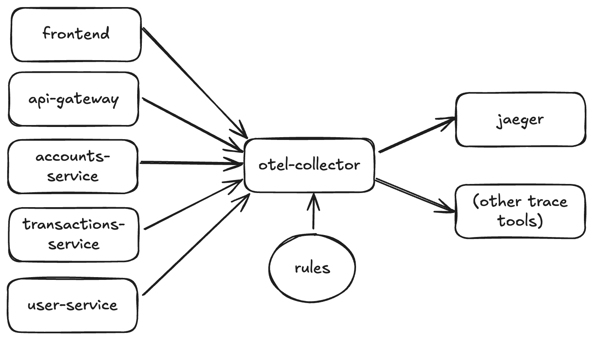

# Observability Guide

This guide covers monitoring, metrics, and tracing for the Banking Application microservices.

## Overview

The application uses a comprehensive observability stack:
- **OpenTelemetry**: Distributed tracing and metrics collection
- **Jaeger**: Trace visualization and analysis
- **Prometheus**: Metrics collection and storage
- **Grafana**: Dashboards and visualization



## Quick Start

### Deploy Observability Stack
```bash
# Deploy all observability components
kubectl apply -k kubernetes/observability/

# Or with Docker Compose
docker-compose up jaeger prometheus grafana -d
```

### Access Tools
```bash
# Jaeger UI
kubectl port-forward -n banking-app svc/jaeger 16686:16686
# Open http://localhost:16686

# Prometheus
kubectl port-forward -n banking-app svc/prometheus 9090:9090
# Open http://localhost:9090

# Grafana (admin/admin)
kubectl port-forward -n banking-app svc/grafana 3001:3000
# Open http://localhost:3001
```

## OpenTelemetry Configuration

### Java Services Configuration

All backend services are configured with OpenTelemetry:

```yaml
# application.yml
otel:
  service:
    name: ${spring.application.name}
  exporter:
    otlp:
      endpoint: http://jaeger:4317
      protocol: grpc
  traces:
    exporter: otlp
    sampler:
      type: always_on
  metrics:
    exporter: otlp
```

### Environment Variables

Services use these OTEL environment variables:
```bash
OTEL_SERVICE_NAME=user-service
OTEL_EXPORTER_OTLP_ENDPOINT=http://jaeger:4317
OTEL_TRACES_EXPORTER=otlp
OTEL_METRICS_EXPORTER=otlp
OTEL_TRACES_SAMPLER=always_on
OTEL_PROPAGATORS=tracecontext
```

### Frontend Configuration

The Next.js frontend uses OpenTelemetry with HTTP instrumentation:
```javascript
// Configured in next.config.js and environment variables
OTEL_SERVICE_NAME=frontend
OTEL_EXPORTER_OTLP_ENDPOINT=http://jaeger:4318/v1/traces
```

## Jaeger Tracing

### What to Expect
- **Cross-service traces**: Frontend → API Gateway → Backend Services → Database
- **HTTP operations**: GET, POST, PUT, DELETE requests
- **Database queries**: SELECT, INSERT, UPDATE operations
- **Service-to-service calls**: Inter-service communication

### Trace Structure
```
Frontend Request
├── API Gateway (route validation, JWT check)
│   ├── User Service (authentication, user operations)
│   ├── Accounts Service (account management)
│   │   └── Database Query (PostgreSQL)
│   └── Transactions Service (financial operations)
│       ├── Database Query (PostgreSQL)
│       └── Accounts Service Call (balance validation)
```

### Viewing Traces
1. Open Jaeger UI: http://localhost:16686
2. Select service from dropdown (e.g., "api-gateway")
3. Search for recent traces
4. Click on a trace to see the full span tree
5. Look for:
   - Trace duration and latency
   - Error spans (highlighted in red)
   - Service dependencies
   - Database query performance

## Prometheus Metrics

### Available Metrics

**HTTP Metrics**:
- `http_server_requests_total` - Total HTTP requests
- `http_server_request_duration_seconds` - Request duration
- `http_server_active_requests` - Active requests

**JVM Metrics**:
- `jvm_memory_used_bytes` - Memory usage
- `jvm_gc_pause_seconds` - Garbage collection
- `jvm_threads_live_threads` - Thread count

**Database Metrics**:
- `hikari_connections_active` - Active DB connections
- `hikari_connections_idle` - Idle DB connections
- `jdbc_connections_active` - JDBC connections

**Custom Business Metrics**:
- `banking_user_registrations_total` - User registrations
- `banking_transactions_total` - Financial transactions
- `banking_account_creations_total` - Account creations

### Prometheus Queries

**Service Health**:
```promql
# Service uptime
up{job="banking-app"}

# Request rate
rate(http_server_requests_total[5m])

# Error rate
rate(http_server_requests_total{status=~"5.."}[5m])

# Request duration 95th percentile
histogram_quantile(0.95, rate(http_server_request_duration_seconds_bucket[5m]))
```

**Database Performance**:
```promql
# Active database connections
hikari_connections_active

# Database query duration
rate(jdbc_connections_total[5m])
```

**Business Metrics**:
```promql
# User registration rate
rate(banking_user_registrations_total[1h])

# Transaction volume
sum(rate(banking_transactions_total[5m])) by (type)
```

## Grafana Dashboards

### Pre-configured Dashboards

The application includes pre-built Grafana dashboards:

1. **Banking Application Overview**
   - Service health and uptime
   - Request rates and error rates
   - Response time percentiles
   - Business metrics (users, accounts, transactions)

2. **Service Performance**
   - Individual service metrics
   - JVM memory and GC metrics
   - Database connection pools
   - HTTP request patterns

3. **Database Monitoring**
   - PostgreSQL performance
   - Query execution times
   - Connection usage
   - Schema-specific metrics

### Creating Custom Dashboards

1. Access Grafana: http://localhost:3001 (admin/admin)
2. Click "+" → "Dashboard"
3. Add panels with Prometheus queries
4. Use these data sources:
   - **Prometheus**: Metrics and time series
   - **Jaeger**: Trace data (if Jaeger data source is configured)

### Dashboard Examples

**Service Health Panel**:
```promql
# Query: Service availability
sum(up{job="banking-app"}) by (instance)
# Visualization: Stat panel
# Thresholds: Green > 0.95, Yellow > 0.90, Red < 0.90
```

**Request Rate Panel**:
```promql
# Query: Requests per second
sum(rate(http_server_requests_total[5m])) by (service)
# Visualization: Time series
# Unit: ops/sec
```

## Monitoring Best Practices

### Alerting

Set up alerts for:
- **Service down**: `up{job="banking-app"} == 0`
- **High error rate**: `rate(http_server_requests_total{status=~"5.."}[5m]) > 0.1`
- **High latency**: `histogram_quantile(0.95, rate(http_server_request_duration_seconds_bucket[5m])) > 1`
- **Database issues**: `hikari_connections_active / hikari_connections_max > 0.8`

### SLIs/SLOs

Define Service Level Indicators:
- **Availability**: 99.9% uptime
- **Latency**: 95% of requests < 500ms
- **Error rate**: < 1% of requests result in 5xx errors
- **Throughput**: Handle expected transaction volume

### Trace Sampling

Configure appropriate sampling:
- **Development**: `always_on` (100% sampling)
- **Production**: `traceidratio` (1-10% sampling)
- **High-volume services**: Lower sampling rates

## Troubleshooting Observability

### Common Issues

**No traces in Jaeger**:
```bash
# Check service configuration
kubectl get configmap app-config -n banking-app -o yaml

# Verify OTEL environment variables
kubectl exec deployment/api-gateway -n banking-app -- env | grep OTEL

# Check Jaeger connectivity
kubectl exec deployment/api-gateway -n banking-app -- curl -v http://jaeger:4317
```

**Missing metrics in Prometheus**:
```bash
# Check Prometheus targets
kubectl port-forward svc/prometheus 9090:9090 -n banking-app
# Visit http://localhost:9090/targets

# Verify service endpoints
kubectl get endpoints -n banking-app
```

**Grafana dashboard issues**:
```bash
# Check Grafana logs
kubectl logs deployment/grafana -n banking-app

# Verify Prometheus data source
# Grafana → Configuration → Data Sources → Prometheus
# URL should be: http://prometheus:9090
```

### Performance Impact

**OpenTelemetry overhead**:
- CPU: ~1-3% overhead
- Memory: ~10-50MB per service
- Network: Minimal with batching

**Reducing overhead**:
- Use sampling in production
- Configure batch export
- Filter unnecessary spans
- Optimize instrumentation libraries

### OTEL Collector Configuration

The application uses OTEL Collector for:
- **Trace filtering**: Remove health check spans
- **Batch processing**: Reduce network overhead
- **Protocol translation**: OTLP to Jaeger format

```yaml
# otel-collector.yaml
processors:
  filter:
    traces:
      exclude:
        match_type: regexp
        services: ["health-check"]
        span_names: [".*(actuator|healthz|metrics).*"]
```

## Advanced Observability

### Custom Instrumentation

Add custom spans in Java:
```java
@Component
public class BankingService {
    private final Tracer tracer = GlobalOpenTelemetry.getTracer("banking-service");
    
    public void processTransaction() {
        Span span = tracer.spanBuilder("process-transaction").startSpan();
        try (Scope scope = span.makeCurrent()) {
            // Business logic
            span.setStatus(StatusCode.OK);
        } catch (Exception e) {
            span.setStatus(StatusCode.ERROR, e.getMessage());
            throw e;
        } finally {
            span.end();
        }
    }
}
```

### Correlation IDs

Services automatically propagate trace context:
- **HTTP headers**: `traceparent`, `tracestate`
- **Log correlation**: Include trace ID in logs
- **Database queries**: Trace database operations

### Distributed Tracing Patterns

**Fan-out pattern** (API Gateway → Multiple Services):
```
API Request
├── User Service (parallel)
├── Accounts Service (parallel)
└── Transactions Service (parallel)
```

**Chain pattern** (Service → Service → Database):
```
Transactions Service
└── Accounts Service
    └── Database Query
```

### Service Map

Jaeger automatically builds service maps showing:
- Service dependencies
- Request volume between services
- Error rates on service edges
- Average latencies

Access via Jaeger UI → "Dependencies" tab.

## Next Steps

1. **Set up alerting**: Configure Prometheus Alertmanager
2. **Add business metrics**: Track domain-specific KPIs
3. **Implement SLO monitoring**: Set up error budgets
4. **Custom dashboards**: Create team-specific views
5. **Log aggregation**: Add ELK stack for log analysis
6. **APM integration**: Consider tools like Datadog or New Relic