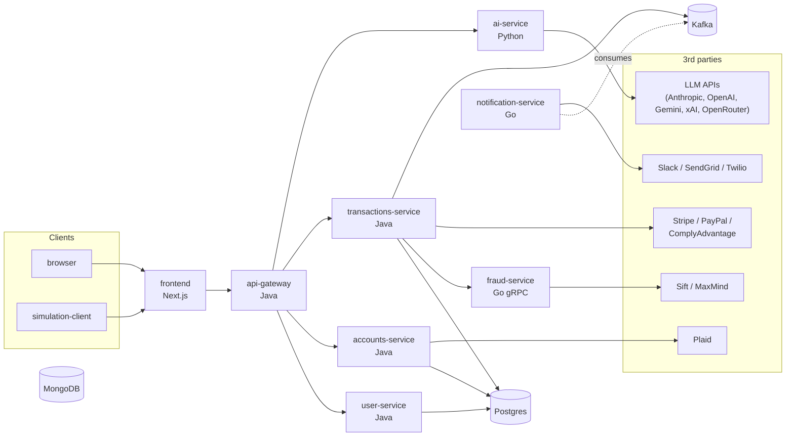

# Banking Application - Microservices

A multi-language banking application with HTTP, gRPC, Kafka, Postgres, MongoDB, and LLM provider integrations. The stack is designed for local development, Kubernetes deployment, observability, and traffic-based service isolation.

## Quick Start

### Run Everything Locally (Docker Compose)
```bash
# Start all services and observability stack
docker-compose up -d

# Access the application and tools
open http://localhost:3000      # Frontend (Next.js 15)
open http://localhost:3001      # Grafana (admin/admin)
open http://localhost:9090      # Prometheus
open http://localhost:16686     # Jaeger
```

### Deploy to Kubernetes
```bash
# Deploy the full app with traffic replay support
kubectl apply -k kubernetes/overlays/speedscale/

# Or deploy without Speedscale routing
kubectl apply -k kubernetes/overlays/local/

# Access the application via your cluster's ingress / load balancer
```

## Architecture

8 backend services across 3 languages, a Next.js frontend, and a load-generating simulation client.

| Service | Language | Purpose |
|---|---|---|
| `api-gateway` | Java (Spring Cloud Gateway) | Edge router, JWT auth, and edge resilience controls |
| `user-service` | Java (Spring Boot) | Authentication, profile management |
| `accounts-service` | Java (Spring Boot) | Account + balance management, Plaid integration |
| `transactions-service` | Java (Spring Boot) | Transaction processing, Stripe / PayPal / ComplyAdvantage integrations |
| `ai-service` | Python (FastAPI) | Chat endpoint that fans out to 5 LLM providers (Anthropic, OpenAI, Gemini, xAI, OpenRouter) and aggregates the replies |
| `fraud-service` | Go (gRPC h2c on :50051) | Fraud risk scoring with Sift / MaxMind / Stripe Radar |
| `notification-service` | Go | Slack / SendGrid / Twilio fan-out for transaction events from Kafka |
| `mongo-service` | Java | Mongo-backed user-data store |
| `frontend` | Next.js 15 / React 19 | Server-side proxy + UI |
| `simulation-client` | Node.js | Drives realistic user-session traffic with burst and negative-path patterns |

**Storage / messaging:** PostgreSQL (per-service schemas), MongoDB, Kafka (transaction event stream).

**Observability:** OpenTelemetry -> otel-collector -> Jaeger (traces) + Prometheus (metrics) + Loki (logs) + Grafana (dashboards).

How **OpenTelemetry trace data** is processed in-process (SDK) and after export (OTLP -> collector on Kubernetes, or direct to Jaeger in Docker Compose) is documented with Mermaid diagrams in [OBSERVABILITY.md - OpenTelemetry trace data processing](./OBSERVABILITY.md#opentelemetry-trace-data-processing) and [architecture.md - OTel trace data processing](./architecture.md#otel-trace-data-processing).


```mermaid
flowchart LR
  subgraph clients["Clients"]
    browser[browser]
    sim[simulation-client]
  end

  frontend[frontend<br/>Next.js]
  gateway[api-gateway<br/>Java]
  accounts[accounts-service<br/>Java]
  transactions[transactions-service<br/>Java]
  users[user-service<br/>Java]
  ai[ai-service<br/>Python]
  fraud[fraud-service<br/>Go gRPC]
  notif[notification-service<br/>Go]

  postgres[(Postgres)]
  mongo[(MongoDB)]
  kafka[(Kafka)]

  subgraph thirdparty["3rd parties"]
    llm["LLM APIs<br/>(Anthropic, OpenAI, Gemini, xAI, OpenRouter)"]
    payments["Stripe / PayPal /<br/>ComplyAdvantage"]
    messaging["Slack / SendGrid / Twilio"]
    plaid["Plaid"]
    risk["Sift / MaxMind"]
  end

  browser --> frontend
  sim --> frontend
  frontend --> gateway
  gateway --> users
  gateway --> accounts
  gateway --> transactions
  gateway --> ai

  accounts --> postgres
  transactions --> postgres
  users --> postgres
  accounts --> plaid

  transactions --> fraud
  transactions --> payments
  transactions --> kafka

  fraud --> risk

  ai --> llm

  notif -.consumes.-> kafka
  notif --> messaging
```

## Traffic Replay

The `speedscale` overlay deploys the app alongside the Speedscale operator and binds every service to a recorded snapshot via a `TrafficReplay` (responder-only mode):

| Workload | Recorded snapshot serves |
|---|---|
| `banking-ai` | All 5 LLM provider responses |
| `banking-accounts` | Plaid balance lookups |
| `banking-transactions` | Stripe, PayPal, ComplyAdvantage |
| `banking-fraud` | Sift, MaxMind, Stripe Radar |
| `banking-notification` | Slack, SendGrid, Twilio |
| `banking-user` | Auth dependencies |

The operator's mutating webhook injects a `speedscale-initproxy-responder` init container into each app pod, which rewrites `/etc/hosts` so outbound third-party hostnames resolve to the in-cluster responder. The responder matches each outbound request by signature (host + method + URL path + body shape) and serves the recorded response.

A PostSync hook (`kubernetes/overlays/speedscale/responders/tr-postsync-reroll.yaml`) rolls any workload whose pods are missing the responder init container after every ArgoCD sync, so a webhook race during a rolling deploy can't silently disable the responder for one of the services.

## Development

### Individual Service Development
Each service has its own Makefile for isolated development and testing:

```bash
cd backend/user-service
make build
make run

# Run with dependencies mocked using proxymock
make proxymock-record  # Record traffic with real dependencies
make proxymock-mock    # Run with mocked dependencies
make proxymock-replay  # Test with recorded traffic
```

### Frontend Development
```bash
cd frontend
npm install
npm run dev            # Development server at http://localhost:3000
npm run build          # Production build
npm test               # Run tests
```

### Database Operations
```bash
# Postgres
psql -h localhost -p 5432 -U postgres -d banking_app

# Mongo
mongosh mongodb://localhost:27017/banking_app

# Run migrations (from a Java service directory)
./mvnw flyway:migrate
```

## Testing

### Backend Tests
```bash
# Java services
./mvnw test
./mvnw verify -P integration-tests

# Go services
cd backend/fraud-service && go test ./...

# Python service
cd backend/ai-service && pytest

# Service-in-isolation
cd backend/user-service && make proxymock-mock
```

### Frontend Tests
```bash
cd frontend
npm test               # Unit tests
npm run test:e2e       # End-to-end tests
```

## Debugging with Proxymock

Each service supports isolated testing without running all dependencies:

```bash
# 1. Record traffic while system is working
cd backend/user-service
make proxymock-record

# 2. Test service in isolation with mocked dependencies
make proxymock-mock    # Starts service with postgres/other services mocked
make proxymock-replay  # Replays recorded requests

# 3. Inspect / clean up
make proxymock-list    # See recorded traffic files
make proxymock-env     # Show environment variables needed
make proxymock-stop    # Stop all proxymock processes
```

### Service Isolation Testing
| Service | What Gets Mocked | Use Case |
|---|---|---|
| user-service | postgres, accounts-service, transactions-service | Auth and user management testing |
| accounts-service | postgres, user-service, Plaid | Account operations testing |
| transactions-service | postgres, accounts-service, fraud-service, Stripe / PayPal / ComplyAdvantage | Transaction processing testing |
| ai-service | 5 LLM provider APIs | Chat-flow testing with deterministic LLM replies |
| fraud-service | Sift / MaxMind / Stripe Radar | Risk-scoring testing |
| notification-service | Kafka, Slack / SendGrid / Twilio | Notification fan-out testing |
| api-gateway | All backend services | API routing and gateway testing |
| frontend | api-gateway | UI testing with mocked backend |

## Key Features

- **Authentication**: JWT-based authentication with HttpOnly cookies
- **Observability**: Distributed tracing (OTel + Jaeger), Prometheus metrics, Loki logs, Grafana dashboards
- **Speedscale integration**: Responder mocks for every third party, deterministic replay
- **Development Tools**: Service-specific Makefiles with proxymock integration
- **Container Ready**: Docker and Kubernetes deployment configurations
- **Load generation**: Simulation client drives realistic burst traffic with configurable negative-path coverage

## Version Management

The project uses semantic versioning with all services sharing the same version number:

```bash
# Check current version
make version                          # Shows: 1.4.75

# Bump version
make version-bump BUMP_TYPE=patch     # 1.4.75 -> 1.4.76
make version-bump BUMP_TYPE=minor     # 1.4.75 -> 1.5.0
make version-bump BUMP_TYPE=major     # 1.4.75 -> 2.0.0

# Update all files and Kubernetes manifests
make version-bump BUMP_TYPE=patch && make update-k8s-version

# Build and deploy with new version
make docker-build-versioned           # Build images with version tag
kubectl apply -k kubernetes/overlays/speedscale/
```

## Documentation

- **[AGENTS.md](./AGENTS.md)** — Guidance for AI assistants and automated agents
- **[TROUBLESHOOTING.md](./TROUBLESHOOTING.md)** — Comprehensive debugging guide
- **[OBSERVABILITY.md](./OBSERVABILITY.md)** — Monitoring, tracing, and metrics setup
- **[PLAN.md](./PLAN.md)** — Detailed implementation phases and testing criteria
- **[architecture.md](./architecture.md)** — System architecture and design decisions

## Getting Started

1. **Prerequisites**: Docker, Docker Compose, Node.js 20+, Java 17+, Maven 3.8+, Go 1.21+, Python 3.12+
2. **Quick start**: Run `docker-compose up -d` to start everything
3. **Development**: Use service-specific Makefiles for isolated development
4. **Testing**: Use proxymock for dependency-free testing
5. **Deployment**: Use Kubernetes manifests for production deployment

## Health Checks

Verify all services are running:
```bash
curl http://localhost:8080/actuator/health  # API Gateway
curl http://localhost:8081/actuator/health  # User Service
curl http://localhost:8082/actuator/health  # Accounts Service
curl http://localhost:8083/actuator/health  # Transactions Service
curl http://localhost:8084/health           # AI Service (FastAPI)
curl http://localhost:8085/health           # Notification Service (Go)
curl http://localhost:3000/api/health       # Frontend
# fraud-service speaks gRPC; use `grpcurl localhost:50051 list`
```

---

For detailed troubleshooting, monitoring setup, and development workflows, see the documentation files listed above.
