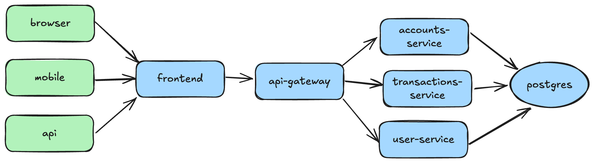

# Banking Application - Microservices Demo

A banking application built with a microservices architecture demonstrating modern development practices including containerization, orchestration, and observability.

## 🚀 TLDR - Quick Start

### Deploy Everything (Kubernetes)
```bash
# Deploy the entire application stack
kubectl apply -k kubernetes/base/

# Deploy observability stack
kubectl apply -k kubernetes/observability/

# Deploy with Speedscale traffic recording (optional)
kubectl apply -k kubernetes/overlays/speedscale/

# Access the application
kubectl get svc -n banking-app frontend-service-nodeport
# For minikube: minikube service frontend-service-nodeport -n banking-app
# For colima: kubectl port-forward -n banking-app svc/frontend-service-nodeport 30000:30000
# Open the URL shown by the command above

# Access observability tools
kubectl port-forward -n banking-app svc/grafana 3001:3000      # Grafana (admin/admin)
kubectl port-forward -n banking-app svc/prometheus 9090:9090   # Prometheus
kubectl port-forward -n banking-app svc/jaeger 16686:16686     # Jaeger
```

### Run Locally (Docker Compose)
```bash
# Start all services
docker-compose up -d

# Access the application
# Frontend: http://localhost:3000
# Grafana: http://localhost:3001 (admin/admin)
# Prometheus: http://localhost:9090
# Jaeger: http://localhost:16686
```


---

## Project Overview

A comprehensive banking application demonstrating microservices architecture with modern development practices including containerization, orchestration, and observability.

## Repository Structure

```
├── backend/
│   ├── user-service/        # User authentication and profile management
│   ├── accounts-service/    # Bank account and balance management
│   ├── transactions-service/ # Financial transaction processing
│   └── api-gateway/        # Request routing and authentication
├── frontend/               # Next.js web application
├── kubernetes/             # Kubernetes manifests and configs
├── config/                 # Application and monitoring configs
└── scripts/                # Essential utility scripts (version, testing, debugging)
```

## Local Development

### Backend Services
```bash
# Build individual service (from service directory)
./mvnw clean package

# Run individual service locally
./mvnw spring-boot:run
```

### Debugging Services

**Option 1: Mixed Local + Docker (Recommended)**
```bash
# Start infrastructure only
docker-compose up postgres jaeger redis -d

# Run service locally for debugging
cd backend/user-service
make run  # Uses service Makefile

# Run other services in Docker
docker-compose up accounts-service transactions-service api-gateway frontend -d

# Connect debugger to localhost:5005
```

**Option 2: Service Isolation with Proxymock**
```bash
# Start infrastructure
docker-compose up postgres jaeger redis -d

# Use service Makefile for isolated testing
cd backend/user-service
make proxymock-record    # Record traffic
make proxymock-mock      # Mock dependencies  
make run-mocked          # Run with mocked deps

# Each service has unique ports to avoid conflicts
# See individual service Makefiles for details
```

**Option 3: Debug in Docker**
Some services have debugging pre-configured (see docker-compose.yml). Connect IDE to `localhost:5005`.

### Frontend Development
```bash
# Start Next.js development server
cd frontend && npm run dev

# Build for production
npm run build

# Run tests
npm test
```

### Database Operations
```bash
# Connect to PostgreSQL
psql -h localhost -U postgres -d banking_app

# Run migrations (from service directory)
./mvnw flyway:migrate
```

### Testing
```bash
# Run backend unit tests
./mvnw test

# Run integration tests
./mvnw verify -P integration-tests

# Run frontend tests
cd frontend && npm test

# Run E2E tests
npm run test:e2e
```

## Architecture



### System Components
- **Frontend**: Next.js application with TypeScript
- **Backend**: Java Spring Boot microservices
- **Database**: PostgreSQL with service-specific schemas
- **Orchestration**: Kubernetes deployment
- **Observability**: OpenTelemetry with Jaeger, Prometheus, and Grafana

### Architecture Key Points
- **Authentication Flow**: JWT tokens generated by user-service, validated by all other services
- **Database Design**: Single PostgreSQL instance with separate schemas per service (user_service, accounts_service, transactions_service)
- **Service Communication**: REST APIs with JSON, all routed through API Gateway
- **Transaction Safety**: Atomic operations with rollback mechanisms in transactions-service
- **Observability**: OpenTelemetry instrumentation across all Java services

## Kubernetes Deployment

### Local Development
```bash
# Deploy with localhost configuration
kubectl apply -k kubernetes/base/
```

### Production Deployment
```bash
# Deploy with production configuration
kubectl apply -k kubernetes/overlays/speedscale/
```

**Note**: For production, edit `kubernetes/overlays/speedscale/frontend-config-patch.yaml` to set your actual API domain instead of `https://your-api-domain.com`.

### Speedscale Overlay (Optional)

Adds traffic recording and replay capabilities:

```bash
# Install Speedscale (requires account)
speedscale install

# Deploy with Speedscale annotations  
kubectl apply -k kubernetes/overlays/speedscale/

# Record and replay traffic
speedscale record --service frontend --duration 5m
speedscale replay --recording-id <id> --target http://localhost:3000
```

See [Speedscale documentation](https://docs.speedscale.com/) for setup details.

### Observability

```bash
# Deploy monitoring stack (Grafana, Prometheus, Jaeger)
kubectl apply -k kubernetes/observability/

# Access tools
kubectl port-forward -n banking-app svc/grafana 3001:3000      # Grafana (admin/admin)
kubectl port-forward -n banking-app svc/prometheus 9090:9090   # Prometheus  
kubectl port-forward -n banking-app svc/jaeger 16686:16686     # Jaeger
```

See [OBSERVABILITY.md](OBSERVABILITY.md) for detailed monitoring setup and troubleshooting.

## Implementation Status

Currently in Phase 1.1 (Repository Structure) - see `plan.md` for detailed phase breakdown and testing criteria. Each phase has specific implementation tasks and testing requirements that must be completed before proceeding to the next phase.

## Key Implementation Notes

- All services must implement JWT validation middleware except user-service (which generates tokens)
- Transaction operations require account ownership validation and sufficient balance checks
- Each service needs OpenTelemetry instrumentation for distributed tracing
- Database schemas are logically separated but physically in the same PostgreSQL instance
- API Gateway handles routing, rate limiting, and global authentication checks
- All services should include comprehensive unit and integration tests with >80% coverage

## Security Considerations

- JWT tokens stored in HttpOnly cookies on frontend
- Database connections use connection pooling with proper credentials
- All services run as non-root users in containers
- API endpoints require authentication except for user registration/login
- Input validation required on all endpoints to prevent injection attacks

## Getting Started

1. **Prerequisites**: Docker, Docker Compose, Node.js, Java 11+, Maven
2. **Clone the repository**
3. **Review the implementation plan**: See `plan.md` for detailed phases
4. **Set up local environment**: Follow Phase 1 tasks in the plan
5. **Start development**: Use the development commands above

## Troubleshooting

For detailed troubleshooting information, see [TROUBLESHOOTING.md](TROUBLESHOOTING.md).

Common quick fixes:
- **Port conflicts**: Check `lsof -i :3000` and use different ports
- **Service not starting**: Check logs with `docker-compose logs [service-name]`
- **Database issues**: Restart with `docker-compose restart postgres`
- **JWT issues**: Clear browser cookies and verify user-service is running

